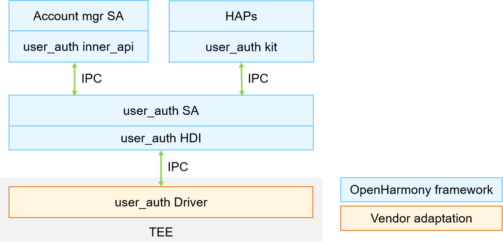

# Unified User Authentication (userauth)


## Introduction

As a basic component of the User Identity & Access Management (IAM) subsystem, Unified User Authentication (userauth) implements unified user authentication and provides biometric feature authentication APIs to third-party applications.

**Figure 1** userauth architecture




The userauth APIs support user authentication of the target Authentication Trust Level (ATL). The target ATL is specified by the service. The target user ID can be specified by the service (system service or basic system application) or obtained from the system context (third-party application).

## Directory Structure

```undefined
//base/user_iam/user_auth
├── frameworks			# Framework code
├── interfaces			# Directory for storing external interfaces
│   └── innerkits		# Header files exposed to the internal subsystems
├── sa_profile			# Profile of the Service ability
├── services			# Implementation of the Service ability
├── test				# Directory for storing test code
├── utils				# Directory for storing utility code
├── bundle.json			# Component description file
└── userauth.gni		# Build configuration
```


## Usage

### Available APIs

**Table 1** APIs for unified user authentication

| API | Description                            |
| ------ | -------------------------------- |
| getAvailableStatus(authType : AuthType, authTrustLevel : AuthTurstLevel) : number; | Obtains the available authentication status.|
| auth(challenge: BigInt, authType : AuthType, authTrustLevel: AuthTurstLevel, callback: IUserAuthCallback): BigInt; | Performs user authentication. |

### Usage Guidelines

- Vendors must implement the following in a Trusted Execution Environment (TEE):

1. Authentication scheme: Determine the user authentication scheme based on the user credentials entered and the target ATL.
2. Authentication result evaluation: Evaluate whether the authentication reaches the target ATL based on the authentication result returned by the executor.

- The APIs defined in the header file ```common\interface\userauth_interface.h``` in the [useriam_auth_executor_mgr](https://gitee.com/openharmony-sig/useriam_coauth) repository must be implemented in a TEE, and the security of user authentication scheme and result evaluation must be ensured.


## Repositories Involved

[useriam_auth_executor_mgr](https://gitee.com/openharmony-sig/useriam_coauth)

[useriam_user_idm](https://gitee.com/openharmony-sig/useriam_useridm)

**[useriam_user_auth](https://gitee.com/openharmony-sig/useriam_userauth)**

[useriam_pin_auth](https://gitee.com/openharmony-sig/useriam_pinauth)

[useriam_faceauth](https://gitee.com/openharmony/useriam_faceauth)
