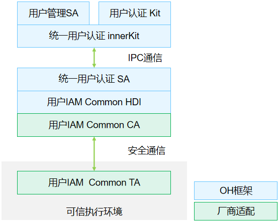

# 统一用户认证

- [简介](#简介)
- [目录](#目录)
- [说明](#说明)
  - [接口说明](#接口说明)
  - [使用说明](#使用说明)
- [相关仓](#相关仓)


## 简介

**统一用户认证**（userauth）是用户IAM子系统的基础部件之一，对外提供统一用户身份认证功能，并且开放生物特征认证API给三方应用调用。

**图1** 统一用户认证架构图




用户认证接口支持针对目标用户完成达到目标认证结果可信等级（ATL）的用户身份认证。其中目标ATL由业务指定，目标用户id可以由业务指定（系统服务或系统基础应用），也可以从系统上下文获取（三方应用）。

## 目录

```undefined
//base/useriam/user_auth_framework
├── common              # 子系统公共库代码目录
├── frameworks          # 接口层实现代码目录
│   └── js              # js接口实现代码
│       └── napi        # napi实现代码
├── interfaces          # 对外接口存放目录
│   └── inner_api       # 对内部子系统暴露的头文件，供系统服务使用
│   └── kits            # OpenHarmony提供给第三方应用的接口文件
├── sa_profile          # Service Ability 配置文件
├── services            # Service Ability 服务实现
├── test                # 测试代码存放目录
├── bundle.json         # 组件描述文件
```


## 说明

### 接口说明

**表1** 统一用户认证API

| 接口名  | 描述                             |
| ------ | -------------------------------- |
| getAvailableStatus(authType : AuthType, authTrustLevel : AuthTrustLevel) : number; | 指定ATL，查询是否支持目标认证方式 |
| auth(challenge: BigInt, authType : AuthType, authTrustLevel: AuthTrustLevel, callback: IUserAuthCallback): BigInt; | 指定ATL和认证方式，完成用户身份认证 |

### 使用说明

- 厂商在对接统一用户认证框架时，需要在可信执行环境中实现以下两个功能点：

1. 认证方案生成：根据目标用户录入的认证凭据和目标认证安全等级，决策用户身份认证方案。
2. 认证结果评估：根据执行器返回的身份认证结果，评估是否达到目标认证安全等级。

- 需在可信执行环境内参考[[drivers_peripheral](https://gitee.com/openharmony/drivers_interface)]仓```user_auth```目录，实现[[drivers_interface](https://gitee.com/openharmony/drivers_interface)]仓内文件```user_auth/v1_0/IUserAuthInterface.idl``` 中定义的接口，保证用户身份认证方案决策和结果评估过程的安全性。

## 相关仓

**[useriam_user_auth_framework](https://gitee.com/openharmony/useriam_user_auth_framework)**

[useriam_pin_auth](https://gitee.com/openharmony/useriam_pin_auth)

[useriam_face_auth](https://gitee.com/openharmony/useriam_face_auth)

[drivers_peripheral](https://gitee.com/openharmony/drivers_peripheral)

[drivers_interface](https://gitee.com/openharmony/drivers_interface)
